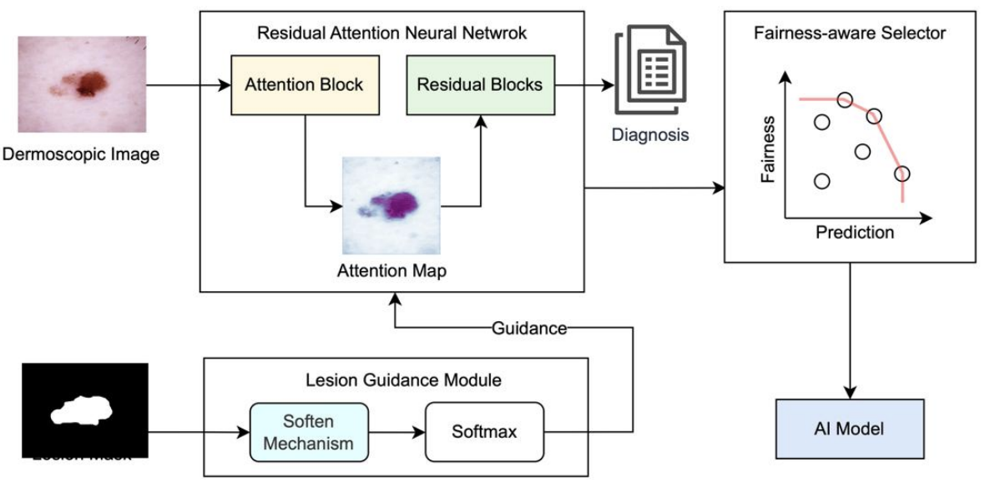

# LesionAttn

This repository contains the code needed to reproduce **LesionAttn**, the proposed method from [Attention-Guided Fair AI Modeling for Skin Cancer Diagnosis](https://arxiv.org/abs/2511.21775). The project studies gender bias in dermatologic AI and uses clinical prior knowledge to guide model attention toward lesion regions, aiming to improve fairness while preserving skin cancer diagnosis performance.



## Repository Layout

```text
LesionAttn/
  configs/              # Dataset, training, and grid-search defaults
  datasets/             # HAM10000 and BCN20000 dataset loaders
  models/               # LesionAttn and ResNet18 attention backbone
  run_fn/               # Training, testing, and Optuna objective functions
  utils/                # Metrics, losses, hparams, and reproducibility helpers
  grid_search.py
  train.py
  test.py
  visualize_attention.py
  requirements.txt
```

## Quick Start

### 1. Set Up The Python Environment

Use Python 3.10 or newer.

```bash
cd LesionAttn
python -m venv .venv
source .venv/bin/activate
pip install --upgrade pip
pip install -r requirements.txt
```

For CUDA builds of PyTorch, install the correct `torch` and `torchvision` wheels from the official PyTorch instructions first, then install the remaining requirements.

### 2. Prepare The Datasets

Create this directory structure under `LesionAttn/`:

```text
data/
  HAM10000/
    images/
      ISIC_0024306.jpg
      ...
    masks/
      ISIC_0024306_segmentation.png
      ...
    HAM10000_metadata.csv
  BCN20000/
    images/
      ISIC_0052212.jpg
      ...
    BCN20000_metadata.csv
```
We provided the datasets on the [Kaggle](). But you can also download them from the original dataset.

HAM10000 can be downloaded from the ISIC challenge data page or the HAM10000 Harvard Dataverse record:

- https://challenge.isic-archive.com/data/
- https://doi.org/10.7910/DVN/DBW86T

The HAM loader expects:

- images as `.jpg` files named from the `image_id` column.
- segmentation masks as `.png` files named `{image_id}_segmentation.png`.
- `HAM10000_metadata.csv` with at least `image_id`, `sex`, and `dx`.

BCN20000 is used only as the external test set. It can be prepared from the ISIC 2019 training data by keeping BCN images and metadata. The BCN loader expects:

- images as `.jpg` files named from the `image` column.
- `BCN20000_metadata.csv` with at least `image`, `sex`, and `dx`.

Rows with missing or unknown sex are excluded. Labels are binarized as malignant vs. non-malignant using the same rules as the original project.

### 3. Run Hyperparameter Grid Search

```bash
python grid_search.py --dataset ham --model lesionattn --backbone resnet18-attn --pretrained
```

Optuna stores results in:

```text
optuna_db/ham-sex_lesionattn-resnet18-attn.db
```

### 4. Train LesionAttn

```bash
python train.py --dataset ham --model lesionattn --backbone resnet18-attn --used_ratio 1.0 --mask_used_ratio 1.0 --pretrained --use_best_hparams
```

Checkpoints and validation summaries are written to:

```text
log/ham-sex(1.0)/lesionattn-resnet18-attn/<seed>/lesionattn.pth
```

If you do not run grid search first, remove `--use_best_hparams` and the default hyperparameters in `configs/train_configs.py` will be used.

### 5. Test On HAM10000 And BCN20000

Run HAM10000 internal testing:

```bash
python test.py --dataset ham --model lesionattn --backbone resnet18-attn
```

Run BCN20000 external testing:

```bash
python test.py --dataset bcn --model lesionattn --backbone resnet18-attn
```

Testing reads HAM-trained checkpoints from `log/ham-sex(...)/...` for each seed. HAM test results are saved as `test_ham_results.csv` and `test_ham_stats.csv`; BCN external results are saved as `test_bcn_external_results.csv` and `test_bcn_external_stats.csv`.

### 6. Visualize Attention Maps

Visualize learned attention maps on HAM:

```bash
python visualize_attention.py --dataset ham --model lesionattn --backbone resnet18-attn --seed 51344 --max_samples 16
```

Visualize learned attention maps on BCN:

```bash
python visualize_attention.py --dataset bcn --model lesionattn --backbone resnet18-attn --seed 51344 --max_samples 16
```

Outputs are saved under:

```text
attention_vis/<dataset>/<seed>/
```
